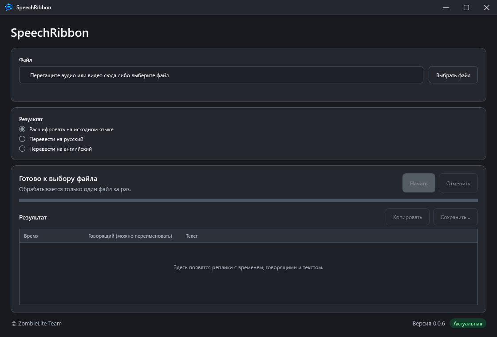
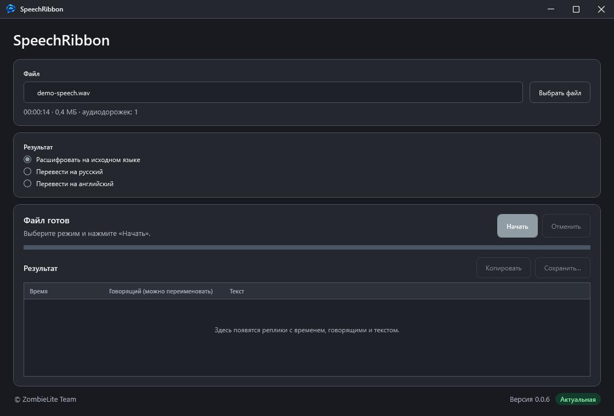
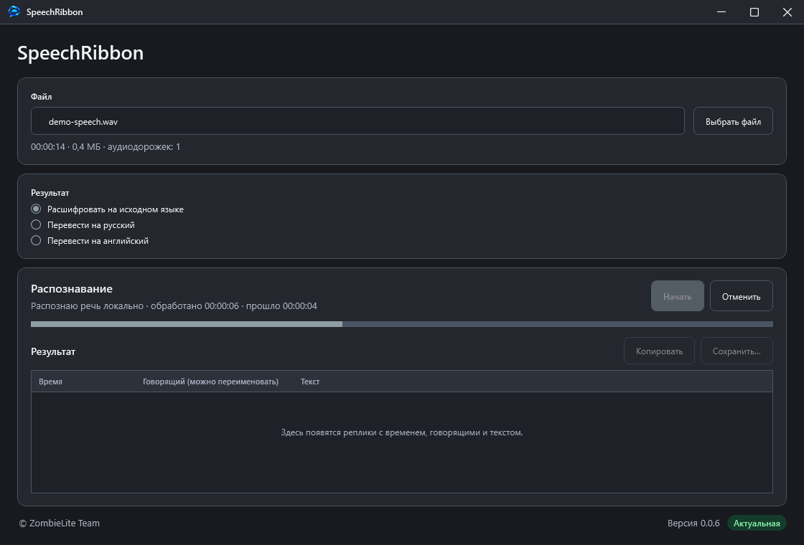
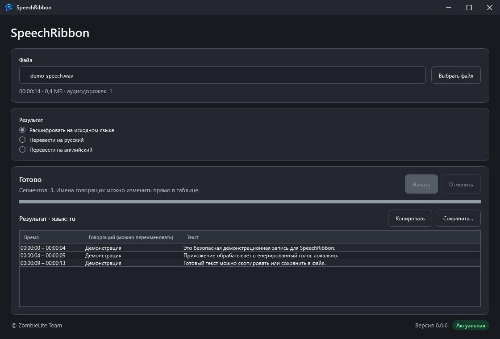

# SpeechRibbon

SpeechRibbon использует локальные ИИ-модели для транскрибации аудио и видео, определения языка, разделения речи по говорящим и перевода результата. Файлы обрабатываются на устройстве и не отправляются в облако.

## Возможности

- Транскрибация аудио и видео с использованием локальных ИИ-моделей.
- Автоматическое определение языка речи.
- Разделение реплик по говорящим.
- Перевод транскрипции с разных языков на русский или английский.
- Экспорт результата в TXT, SRT и VTT.

## Скачать

[Скачать SpeechRibbon 0.0.6 — Windows 10/11, x64, Portable](dist/SpeechRibbon-0.0.6.exe)

Размер файла: около 444 МБ.

SHA-256:

```text
3B532696EABB40F43E548D48838490521471B1D0BF906B78C1A69CA11898DBE1
```

## Системные требования

- Windows 10/11 x64.
- Процессор с поддержкой AVX2 и не менее четырёх физических ядер.
- 8 ГБ оперативной памяти.

## Поддерживаемые форматы

- Аудио: WAV, MP3, FLAC, M4A, AAC, OGG, OGA, OPUS, WMA.
- Видео: MP4, M4V, MOV, MKV, WEBM, AVI, WMV.

## Как пользоваться

1. Скачайте и запустите SpeechRibbon.
2. Выберите аудио или видео.
3. По умолчанию приложение транскрибирует речь на исходном языке. При необходимости выберите перевод на русский или английский.
4. Запустите обработку.
5. Скопируйте результат или сохраните его в TXT, SRT либо VTT.

## Скриншоты

| Главное окно | Выбран файл |
|---|---|
|  |  |

| Обработка | Результат |
|---|---|
|  |  |

## Сборка из исходников

Инструкция по сборке находится в [BUILDING.md](BUILDING.md).

Крупные модели и необходимые компоненты хранятся через Git LFS. После клонирования репозитория выполните:

```powershell
git lfs pull
```

## Ограничения

- Не поддерживаются защищённые DRM, зашифрованные и повреждённые файлы.
- В музыкальных записях распознаётся только слышимая речь; отделение вокала от инструментов не выполняется.
- Разделение по говорящим, особенно при одновременной речи, может быть неточным.

## Лицензия

Исходный код SpeechRibbon распространяется по [лицензии MIT](LICENSE). Условия использования сторонних компонентов [указаны отдельно](THIRD-PARTY-NOTICES.md).
